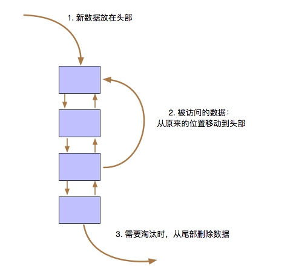
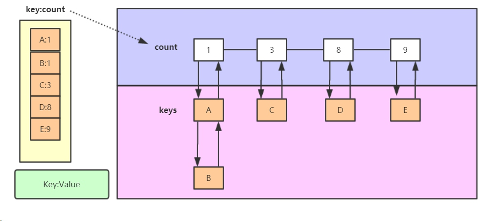
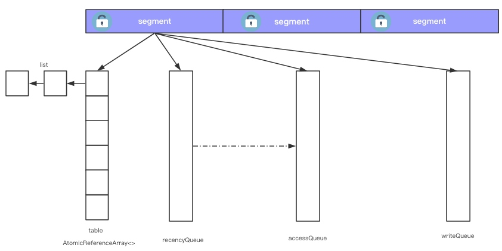
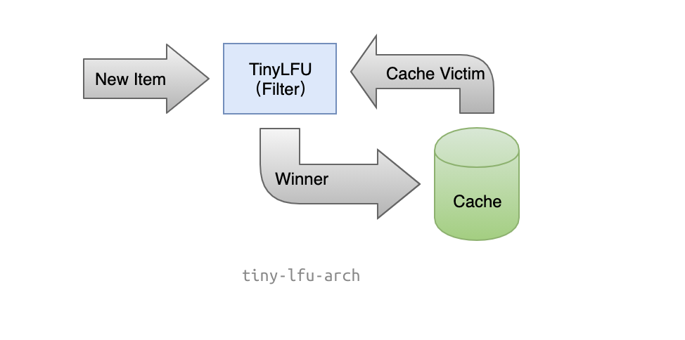
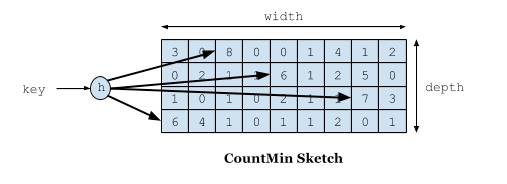
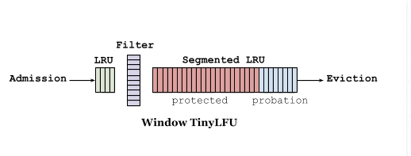
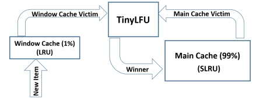

# LFU、LRU、TinyLFU 、W-TinyLFU

## 概述
本文介绍一些常见的缓存设计算法和思路。比如缓存淘汰的算法：LRU，SLRU，LFU，W-TinyLFU

## LRU
LRU的全称是Least Recently Used，最近最少使用。如果缓存满了，把最近没有被使用到的数据移出。

### LRU算法的思想
 如果一个数据在最近一段时间没有被访问到，那么可以认为在将来它被访问的可能性也很小。

因此，当空间满时，最久没有访问的数据最先被置换（淘汰）

 

### LRU算法的描述
设计一种缓存结构，该结构在构造时确定大小，假设大小为 K，并有两个功能：

set(key,value)：将记录(key,value)插入该结构。当缓存满时，将最久未使用的数据置换掉。
get(key)：返回key对应的value值。
实现：最朴素的思想就是用数组+时间戳的方式，不过这样做效率较低（查找效率不高）。

因此，我们可以用双向链表（LinkedList）+哈希表（HashMap）实现（链表用来表示位置，哈希表用来存储和查找），

在Java里有对应的数据结构LinkedHashMap。

### 局限性
LRU可以很好的应对突发流量的情况，因为他不需要累计数据频率。

但LRU通过历史数据来预测未来是局限的，

它会认为最后到来的数据是最可能被再次访问的，从而给与它最高的优先级。

在现有算法的局限性下，会导致缓存数据的命中率或多或少的受损。

## LFU
LFU(Least Frequently Used)即最近最不常用，它的核心思想是只缓存那些经常使用的。

这个算法必须要维护数据的访问频次，按照频次排序，淘汰频次最低的数据。

### LFU算法的思想：
 如果一个数据在最近一段时间很少被访问到，那么可以认为在将来它被访问的可能性也很小。

因此，当空间满时，最小频率访问的数据最先被淘汰。

## LFU 算法的描述
设计一种缓存结构，该结构在构造时确定大小，假设大小为 K，并有两个功能：

set(key,value)：将记录(key,value)插入该结构。当缓存满时，将访问频率最低的数据置换掉。
get(key)：返回key对应的value值。

算法实现策略：考虑到 LFU 会淘汰访问频率最小的数据，我们需要一种合适的方法按大小顺序维护数据访问的频率。

LFU 算法本质上可以看做是一个 top K 问题(K = 1)，即选出频率最小的元素，

最终实现策略为小顶堆+哈希表。

### 局限性
偶发性的、周期性的批量操作会导致LRU命中率急剧下降，缓存污染情况比较严重

对于突发性的热点事件，比如微博爆出明星糗事就是一个突发性热点事件，

当事件结束后，可能没有啥访问量了，但是由于其极高的访问频率，导致其在未来很长一段时间内都不会被淘汰掉。

 
## Guava cache 实现SLRU
 

把table分到一个个segment下，每个segment对应一个锁，来分散全局锁带来的性能损失，GuavaCache就是这样的实现，如下图。

guava cache还维护两个队列，accesQueue和writeQueue，用来实现segement的局部LRU和过期时间。

另外还有一个recencyQueue，它用来提高accessQueue更新锁消耗。

如果每次访问都加锁更新accessQueue，影响性能，

guava把访问的数据更新到recencyQueue，recencyQueue通过ConcurrentLinkedQueue实现，并发安全。

等写入数据时，再加锁从recencyQueue更新到accesQueue。

另外，对于过期数据的清理，guava并不是另起一个线程，而是每次有访问的时候才清理。

 

## TinyLFU
TinyLFU 顾名思义，轻量级LFU，相比于 LFU 算法用更小的内存空间来记录访问频率。

 

TinyLFU维护了近期访问记录的频率信息，作为一个过滤器，

当新记录来时，只有满足TinyLFU要求的记录才可以被插入缓存。

其中实现算法采用ount-Min Sketch算法。以LRU作为淘汰方式，TinyLFU作为许入过滤器。

所以他可以很好地应对突发性的热点事件（超过一定时间，这些记录不再被维护）。

这些访问记录会作为一个过滤器（TinyLFU作为许入过滤器），

当新加入的记录（New Item）访问频率高于将被淘汰的缓存记录（Cache Victim）时才会被替换

### 它需要解决两个挑战
 一个是如何避免维护频率信息的高开销；
TinyLFU借助了数据流Sketching技术，Count-Min Sketch显然是解决这个问题的有效手段，
它可以用小得多的空间存放频率信息，而保证很低的False Positive Rate

另一个是如何反应随时间变化的访问模式。
TinyLFU采用了一种基于滑动窗口的时间衰减设计机制，借助于一种简易的reset操作: 
每次添加一条记录到Sketch的时候，都会给一个计数器上加1，
当计数器达到一个尺寸W的时候，把所有记录的Sketch数值都除以2，该reset操作可以起到衰减的作用
CountMin Sketch 通过矩阵和多个hash函数实现
 

一个key，通过不同的hash定位到数组index，值加1，最后取min(8,6,7,6)=6作为此key的访问次数记录。

因为hash冲突的原因，值不一定准确，但对于LFU的实现，这个误差可以忽略。下面我们看它是怎么解决LFU缺点的。

 

因为使用矩阵，跟数据量大小没关系，很好地解决了LFU的内存开销问题。

对于数据年龄，可以添加一个计数上线，一旦到达上线，所有记录的Sketch数据都除2，

从而实现衰减效果，对于短暂热点数据，如果之后一直没有访问，count/2不断衰减，直至淘汰。

下图是另一种表达方式： sketch 作为过滤器（filter）。当新来的数据比要驱逐的数据高频时，这个数据才会被缓存接纳。

## W-TinyLFU
 

W-TinyLFU主要用来解决一些稀疏的突发访问元素。在一些数目很少但突发访问量很大的场景下，

TinyLFU将无法保存这类元素，因为它们无法在给定时间内积累到足够高的频率。

因此W-TinyLFU就是结合LFU和LRU，前者用来应对大多数场景，而LRU用来处理突发流量。

其中TinyLFU维护了近期访问记录的频率信息，作为一个过滤器，当新记录来时，

只有满足TinyLFU要求的记录才可以被插入缓存。

其中实现算法采用count-Min Sketch算法。以LRU作为淘汰方式，TinyLFU作为许入过滤器。

 

## 总结
 
  今天主要讲 LRU，SLRU，LFU，W-TinyLFU 这几种算法，

基于java8的库caffeine就是使用到 W-TinyLFU来实现

 
## 原文

http://thoreauz.com/2018/02/08/local-cache/

https://www.yuque.com/minicloud/java/uaya0t

 

