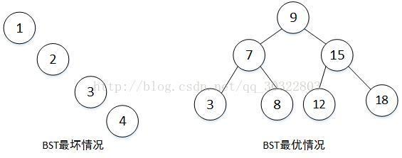
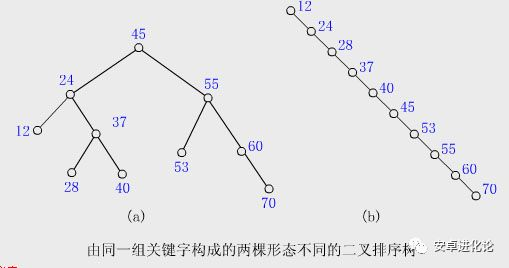

## [原文](https://zh.wikipedia.org/wiki/%E4%BA%8C%E5%85%83%E6%90%9C%E5%B0%8B%E6%A8%B9)

## [参考](https://blog.csdn.net/heyue_99/article/details/74833808)

#  二叉排序树（二叉查找树）英语：Binary Search Tree

> 二叉查找树（英语：Binary Search Tree），也称为二叉搜索树、有序二叉树（ordered binary tree）
或排序二叉树（sorted binary tree），是指一棵空树或者具有下列性质的二叉树：

二叉排序树：或者是一棵空树，或者是具有下列性质的二叉树：

1. 若它的左子树不空，则左子树上所有结点的值均小于它的根结点的值；

2. 若它的右子树不空，则右子树上所有结点的值均大于它的根结点的值；

3. 它的左、右子树也分别为二叉排序树。

4. 没有键值相等的节点。

二叉查找树相比于其他数据结构的优势在于查找、插入的时间复杂度较低。
为 O(log n)。二叉查找树是基础性数据结构，用于构建更为抽象的数据结构，如集合、多重集、关联数组等。

二叉查找树的查找过程和次优二叉树类似，通常采取二叉链表作为二叉查找树的存储结构。
中序遍历二叉查找树可得到一个关键字的有序序列，   
一个无序序列可以通过构造一棵二叉查找树变成一个有序序列，构造树的过程即为对无序序列进行查找的过程。
每次插入的新的结点都是二叉查找树上新的叶子结点，在进行插入操作时，不必移动其它结点，只需改动某个结点的指针，由空变为非空即可。
搜索、插入、删除的复杂度等于树高，期望 O(log n)，最坏 O(n)（数列有序，树退化成线性表）。

虽然二叉查找树的最坏效率是 O(n)，但它支持动态查询，
且有很多改进版的二叉查找树可以使树高为 O(log n)，从而将最坏效率降至  O(log n)，如AVL树、红黑树等。

> 平衡树是计算机科学中的一类改进的二叉查找树 

> 最优BST树形结构和最差BST树形（左边的二叉查找树退化成链表）

> 最差时候会是 O(n)，比如插入的元素是有序的，生成的二叉排序树就是一个链表，这种情况下，需要遍历全部元素才行