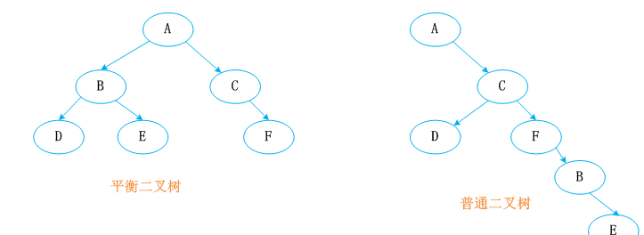
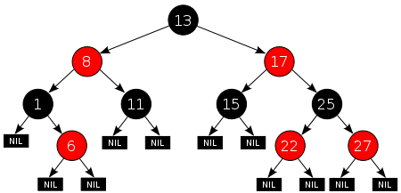
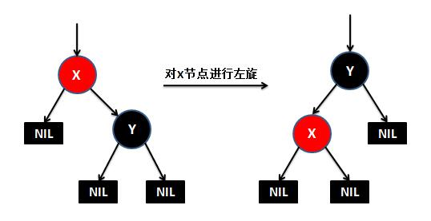
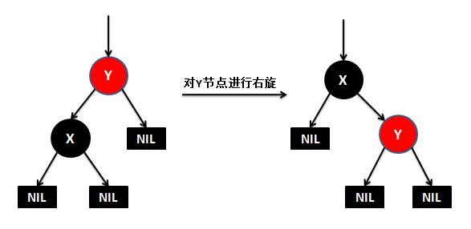

## [原文](https://www.jianshu.com/p/fc5e16b5c674)

# 红黑树 

红黑树又称红-黑二叉树，它首先是一颗二叉树，它具体二叉树所有的特性。同时红黑树更是一颗自平衡的排序二叉树。

我们知道一颗基本的二叉树他们都需要满足一个基本性质：
即树中的任何节点的值大于它的左子节点，且小于它的右子节点。

按照这个基本性质使得树的检索效率大大提高。
我们知道在生成二叉树的过程是非常容易失衡的，最坏的情况就是一边倒（只有右/左子树），
这样势必会导致二叉树的检索效率大大降低（O(n)），
所以为了维持二叉树的平衡，大牛们提出了各种实现的算法，如：AVL，SBT，伸展树，TREAP ，红黑树等等。

平衡二叉树必须具备如下特性：它是一棵空树或它的左右两个子树的高度差的绝对值不超过1，
并且左右两个子树都是一棵平衡二叉树。也就是说该二叉树的任何一个等等子节点，其左右子树的高度都相近。

红黑树顾名思义就是节点是红色或者黑色的平衡二叉树，它通过颜色的约束来维持着二叉树的平衡。
对于一棵有效的红黑树二叉树而言我们必须增加如下规则：

- 每个节点都只能是红色或者黑色

- 根节点是黑色

- 每个叶节点（NIL节点，空节点）是黑色的。

- 如果一个结点是红的，则它两个子节点都是黑的。也就是说在一条路径上不能出现相邻的两个红色结点。

- 从任一节点到其每个叶子的所有路径都包含相同数目的黑色节点。

红黑树示意图如下：

上面的规则前4条都好理解，第5条规则到底是什么情况，
下面简单解释下，比如图中红8到1左边的叶子节点的路径包含两个黑色节点，到6下面的叶子节点的路径也包含两个黑色节点。

但是在在添加或删除节点后，红黑树就发生了变化，可能不再满足上面的5个特性，
为了保持红黑树的以上特性，就有了三个动作：左旋、右旋、着色。

下面来看下什么是红黑树的左旋和右旋：

对x进行左旋，意味着"将x变成一个左节点"。

对y进行右旋，意味着"将y变成一个右节点"。

如果还是没看明白，下面找了两张左旋和右旋的动态图

ok，对二叉树、红黑树的概念有所了解后，我们来看下红黑树的两个主要逻辑添加和删除，看看TreeMap是怎么实现的。

## 应用
   
1. 广泛用于C ++的STL中，地图和集都是用红黑树实现的; 

2. 着名的Linux的的进程调度完全公平调度程序，用红黑树管理进程控制块，进程的虚拟内存区域都存储在一颗红黑树上，
每个虚拟地址区域都对应红黑树的一个节点，左指针指向相邻的地址虚拟存储区域，右指针指向相邻的高地址虚拟地址空间; 

3. IO多路复用的epoll的的的实现采用红黑树组织管理的的的sockfd，以支持快速的增删改查; 

4. Nginx的的的中用红黑树管理定时器，因为红黑树是有序的，可以很快的得到距离当前最小的定时器; 

5. Java的的的中TreeMap中的中的实现;
