## [原文](https://zhuanlan.zhihu.com/p/31805309)

# 漫画：什么是红黑树？

  

  
  

  
  

 
  

## 二叉查找树（BST）具备什么特性呢？

1. 左子树上所有结点的值均小于或等于它的根结点的值。

2. 右子树上所有结点的值均大于或等于它的根结点的值。

3. 左、右子树也分别为二叉排序树。

下图中这棵树，就是一颗典型的二叉查找树：

  
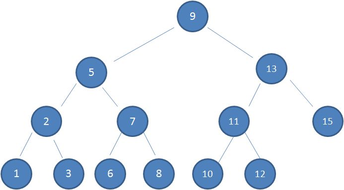
  

1.查看根节点9：
  
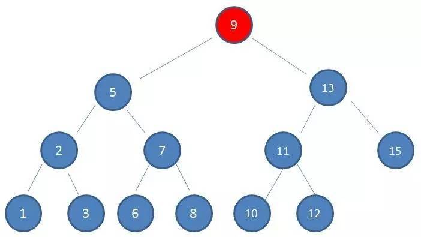

2.由于10 > 9，因此查看右孩子13：
  
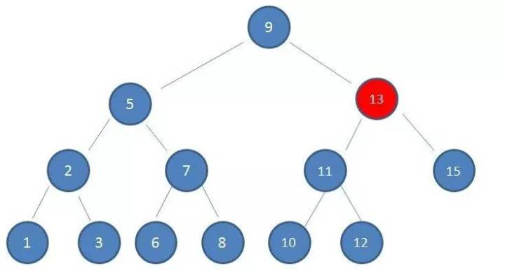
  
3.由于10 < 13，因此查看左孩子11：

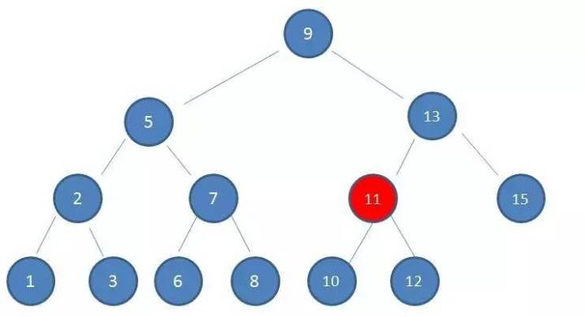

4.由于10 < 11，因此查看左孩子10，发现10正是要查找的节点：  

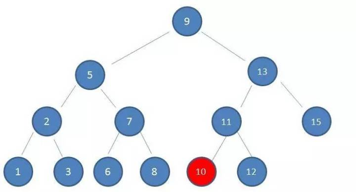

假设初始的二叉查找树只有三个节点，根节点值为9，左孩子值为8，右孩子值为12：

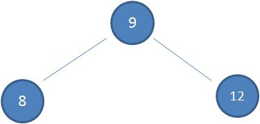

接下来我们依次插入如下五个节点：7,6,5,4,3。依照二叉查找树的特性，结果会变成什么样呢？

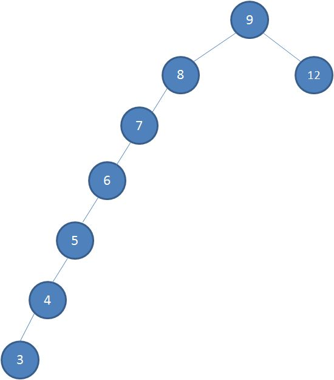

1.节点是红色或黑色。

2.根节点是黑色。

3.每个叶子节点都是黑色的空节点（NIL节点）。

4 每个红色节点的两个子节点都是黑色。(从每个叶子到根的所有路径上不能有两个连续的红色节点)

5.从任一节点到其每个叶子的所有路径都包含相同数目的黑色节点。

下图中这棵树，就是一颗典型的红黑树：

什么情况下会破坏红黑树的规则，什么情况下不会破坏规则呢？我们举两个简单的栗子：

1.向原红黑树插入值为14的新节点：

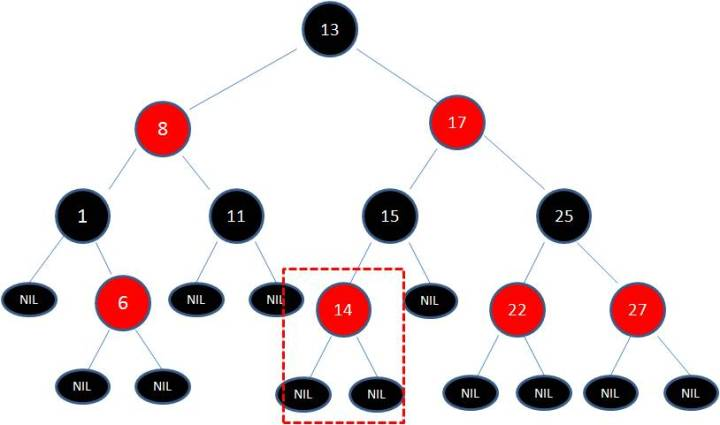

由于父节点15是黑色节点，因此这种情况并不会破坏红黑树的规则，无需做任何调整。

 
2.向原红黑树插入值为21的新节点：

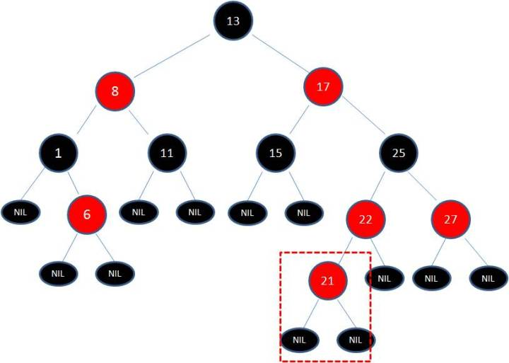

由于父节点22是红色节点，因此这种情况打破了红黑树的规则4（每个红色节点的两个子节点都是黑色），
必须进行调整，使之重新符合红黑树的规则。

变色：

为了重新符合红黑树的规则，尝试把红色节点变为黑色，或者把黑色节点变为红色。

下图所表示的是红黑树的一部分，需要注意节点25并非根节点。
因为节点21和节点22连续出现了红色，不符合规则4，所以把节点22从红色变成黑色：

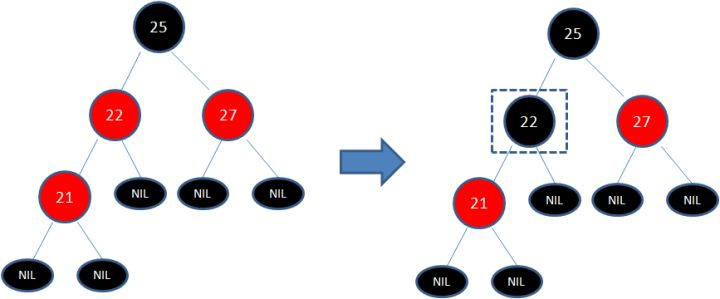

但这样并不算完，因为凭空多出的黑色节点打破了规则5，所以发生连锁反应，需要继续把节点25从黑色变成红色：

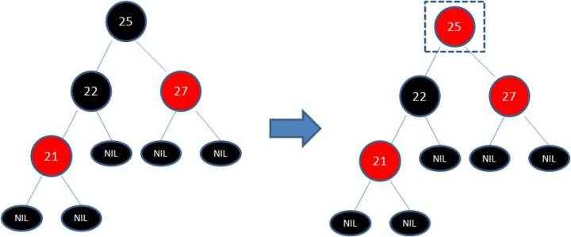

此时仍然没有结束，因为节点25和节点27又形成了两个连续的红色节点，需要继续把节点27从红色变成黑色：

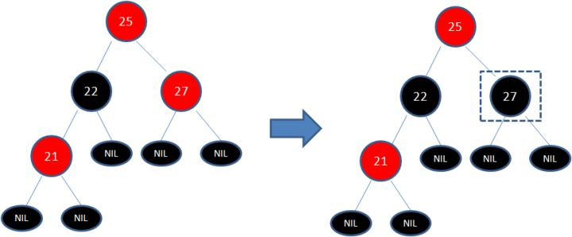

## 左旋转：

逆时针旋转红黑树的两个节点，使得父节点被自己的右孩子取代，而自己成为自己的左孩子。
说起来很怪异，大家看下图：

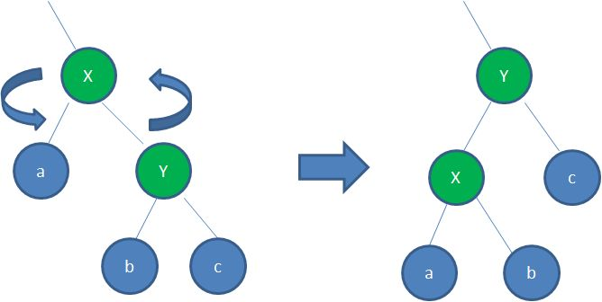

图中，身为右孩子的Y取代了X的位置，而X变成了自己的左孩子。此为左旋转。

## 右旋转：

顺时针旋转红黑树的两个节点，使得父节点被自己的左孩子取代，而自己成为自己的右孩子。大家看下图：
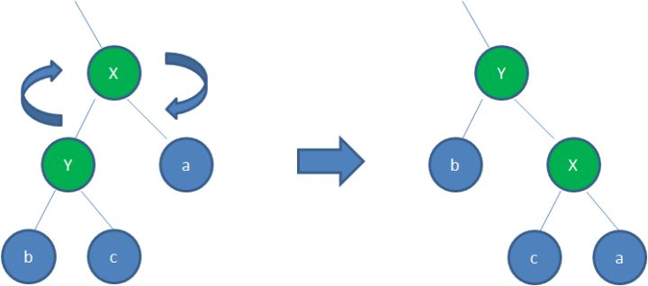

图中，身为左孩子的Y取代了X的位置，而X变成了自己的右孩子。此为右旋转。

我们以刚才插入节点21的情况为例：

首先，我们需要做的是变色，把节点25及其下方的节点变色：
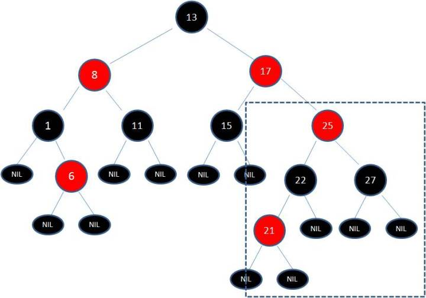

此时节点17和节点25是连续的两个红色节点，为了维持红黑树的规则，
我们把节点8和节点17进行变色，由红色节点编程黑色节点。
这样以来就形成了新的红黑树（这里感谢网友的指正，之前所讲的变换方式有问题）：

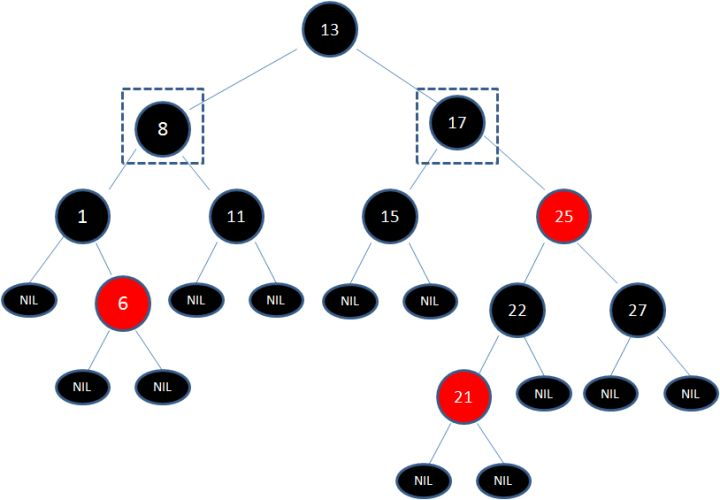

  

几点说明：

1. 关于红黑树自平衡的调整，插入和删除节点的时候都涉及到很多种Case，
由于篇幅原因无法展开来一一列举，有兴趣的朋友可以参考[维基百科](https://zh.wikipedia.org/wiki/%E7%BA%A2%E9%BB%91%E6%A0%91)，里面讲的非常清晰。

2.漫画中红黑树调整过程的示例是一种比较复杂的情形，没太看明白的小伙伴也不必钻牛角尖，
关键要懂得红黑树自平衡调整的主体思想。
