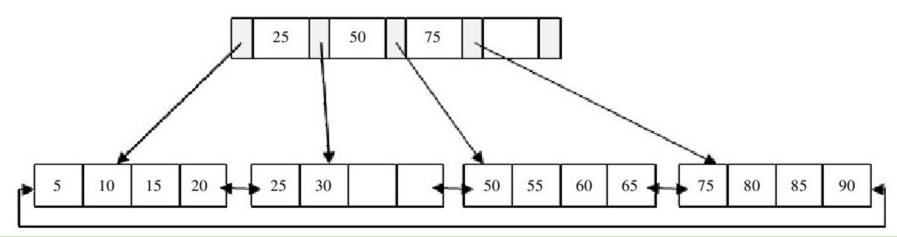

## [原文](https://zh.wikipedia.org/wiki/B%2B%E6%A0%91)

## [原文](https://www.cnblogs.com/wade-luffy/p/6292784.html)

# B+树介绍

B+ 树是一种树数据结构，通常用于数据库和操作系统的文件系统中。B+ 树的特点是能够保持数据稳定有序，
其插入与修改拥有较稳定的对数时间复杂度。B+ 树元素自底向上插入，这与二叉树恰好相反。

B+ 树在节点访问时间远远超过节点内部访问时间的时候，比可作为替代的实现有着实在的优势。
这通常在多数节点在次级存储比如硬盘中的时候出现。通过最大化在每个内部节点内的子节点的数目减少树的高度，平衡操作不经常发生，
而且效率增加了。这种价值得以确立通常需要每个节点在次级存储中占据完整的磁盘块或近似的大小。

B+树和二叉树、平衡二叉树一样，都是经典的数据结构。B+树由B树和索引顺序访问方法（ISAM，是不是很熟悉？对，
这也是MyISAM引擎最初参考的数据结构）演化而来，但是在实际使用过程中几乎已经没有使用B树的情况了。

B+树的定义十分复杂，因此只简要地介绍B+树：B+树是为磁盘或其他直接存取辅助设备而设计的一种平衡查找树，
在B+树中，所有记录节点都是按键值的大小顺序存放在同一层的叶节点中，各叶节点指针进行连接。

我们先来看一个B+树，其高度为2，每页可存放4条记录，扇出（fan out）为5

可以看出，所有记录都在叶节点中，并且是顺序存放的，如果我们从最左边的叶节点开始顺序遍历，
可以得到所有键值的顺序排序：5、10、15、20、25、30、50、55、60、65、75、80、85、90。

## B + 树和 B 树的区别

区别就是就是 B树会在每个节点都保存数据，
在B+树中，所有记录节点都是按键值的大小顺序存放在同一层的叶节点中，各叶节点指针进行连接,所有记录都在叶节点中