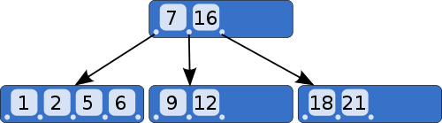

## [原文](http://www.ruanyifeng.com/blog/2014/07/database_implementation.html)

# 什么是B树？

要理解B树，必须从[二叉查找树](http://zh.wikipedia.org/wiki/%E4%BA%8C%E5%85%83%E6%90%9C%E5%B0%8B%E6%A8%B9)（Binary search tree）讲起。

二叉查找树是一种查找效率非常高的数据结构，它有三个特点。

（1）每个节点最多只有两个子树。

（2）左子树都为小于父节点的值，右子树都为大于父节点的值。

（3）在n个节点中找到目标值，一般只需要log(n)次比较。

二叉查找树的结构不适合数据库，因为它的查找效率与层数相关。
越处在下层的数据，就需要越多次比较。极端情况下，n个数据需要n次比较才能找到目标值。
对于数据库来说，每进入一层，就要从硬盘读取一次数据，这非常致命，因为硬盘的读取时间远远大于数据处理时间，
数据库读取硬盘的次数越少越好。

B树是对二叉查找树的改进。它的设计思想是，将相关数据尽量集中在一起，以便一次读取多个数据，减少硬盘操作次数。

B树的特点也有三个。

（1）一个节点可以容纳多个值。比如上图中，最多的一个节点容纳了4个值。

（2）除非数据已经填满，否则不会增加新的层。也就是说，B树追求"层"越少越好。

（3）子节点中的值，与父节点中的值，有严格的大小对应关系。
一般来说，如果父节点有a个值，那么就有a+1个子节点。比如上图中，父节点有两个值（7和16），
就对应三个子节点，第一个子节点都是小于7的值，最后一个子节点都是大于16的值，中间的子节点就是7和16之间的值。

这种数据结构，非常有利于减少读取硬盘的次数。假定一个节点可以容纳100个值，那么3层的B树可以容纳100万个数据，
如果换成二叉查找树，则需要20层！假定操作系统一次读取一个节点，并且根节点保留在内存中，
那么B树在100万个数据中查找目标值，只需要读取两次硬盘。

## 三、索引
数据库以B树格式储存，只解决了按照"主键"查找数据的问题。如果想查找其他字段，就需要建立索引（index）。

所谓索引，就是以某个字段为关键字的B树文件。

假定有一张"雇员表"，包含了员工号（主键）和姓名两个字段。
可以对姓名建立索引文件，该文件以B树格式对姓名进行储存，每个姓名后面是其在数据库中的位置（即第几条记录）。
查找姓名的时候，先从索引中找到对应第几条记录，然后再从表格中读取。

这种索引查找方法，叫做["索引顺序存取方法"](http://en.wikipedia.org/wiki/ISAM)（Indexed Sequential Access Method），缩写为ISAM。
它已经有多种实现（比如C-ISAM库和D-ISAM库），只要使用这些代码库，就能自己写一个最简单的数据库。

> mysql中普遍使用B+Tree做索引，但在实现上又根据聚簇索引和非聚簇索引而不同。

## 有一道MySQL的面试题，为什么MySQL的索引要使用B+树而不是其它树形结构?比如B树？

现在这个问题的复杂版本可以参考本文；

他的简单版本回答是：

因为B树不管叶子节点还是非叶子节点，都会保存数据，这样导致在非叶子节点中能保存的指针数量变少（有些资料也称为扇出），
指针少的情况下要保存大量数据，只能增加树的高度，导致IO操作变多，查询性能变低

- [为什么MySQL数据库要用B+树存储索引？]()

- [MySQL索引背后的数据结构及算法原理](https://github.com/pankui/database-learning/blob/master/mysql/01%E3%80%81MySQL%E7%B4%A2%E5%BC%95%E8%83%8C%E5%90%8E%E7%9A%84%E6%95%B0%E6%8D%AE%E7%BB%93%E6%9E%84%E5%8F%8A%E7%AE%97%E6%B3%95%E5%8E%9F%E7%90%86.md)

- [MySQL索引原理](https://github.com/pankui/database-learning/blob/master/mysql/21%E3%80%81MySQL%E7%B4%A2%E5%BC%95%E5%8E%9F%E7%90%86.md)