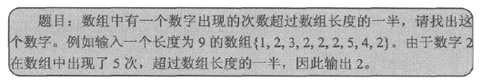

## [原文](https://www.cnblogs.com/sunniest/p/4596182.html)

# 几个面试经典算法题Java解答

## 题目一：


- [点击我看例子](/algorithms-java-example/src/main/java/space.mamba/interview/ClockwiseOutput.java)  
 

## 题目二：
给出一个排序好的数组和一个数，求数组中连续元素的和等于所给数的子数组

```java
//给出一个排序好的数组和一个数，求数组中连续元素的和等于所给数的子数组
    
    @Test
    public void test(){
        int[] num = {1,2,2,3,4,5,6,7,8,9};
        int sum = 7;
        findSum(num,sum);
    }
    
    public void findSum(int[] num,int sum){
        int left=0;
        int right=0;
        
        for(int i=0;i<num.length;i++){
            int curSum = 0;
            left = i;
            right = i;
            while(curSum<sum){
                curSum += num[right++];
            }            
            if(curSum==sum){
                for(int j=left;j<right;j++){
                    System.out.print(num[j]+" ");
                }
                System.out.println();
            }
        }
    }
```

## 题目三：


```java
//字符数组组成的所有字符串
    
    @Test
    public void test(){
        //char[] cs = {'a','b','c','d','e'};        
        char[] cs = {'a','b','c'};    
        int length = cs.length;        
        recursionSwap(cs,0,length);
    }
    
    public void swap(char[] cs,int index1,int index2){
        char temp = cs[index1];
        cs[index1]=cs[index2];
        cs[index2]=temp;        
    }
    
    public void recursionSwap(char[] cs,int start,int length){
        if(start>=length-1){
            print(cs);
            return;
        }
        for(int i=start;i<length;i++){
            swap(cs,start,i);
            recursionSwap(cs,start+1,length);    
            swap(cs,start,i);
        }
    }
    
    public void print(char[] cs){
        for(int i=0;i<cs.length;i++){
            System.out.print(cs[i]);
        }
        System.out.println();
    }
```

## 题目四：


```java
//数组组成的最小数
    
    @Test
    public void test(){
        int[] num={1,5,9,13,442,44,6,21,211};
        qsort(num,0,num.length-1);
        System.out.println(Arrays.toString(num));
    }
    
    public void qsort(int[] num,int left,int right){
        if(left<right){
            int partition = partition(num,left,right);
            qsort(num,left,partition-1);
            qsort(num,partition+1,right);
        }    
    }
    
    public int partition(int[] num,int left,int right){
        int partition = num[left];
        while(left<right){
            while((num[right]==partition || isMBigerThanN(num,num[right],partition)) && left<right){
                right--;
            }            
            swap(num,left,right);    
            while((num[left]==partition || isMBigerThanN(num,partition,num[left])) && left<right){
                left++;
            }
            swap(num,left,right);        
        }
        
        return left;
    }
    
    public void swap(int[] num,int m,int n){
        int temp = num[m];
        num[m]=num[n];
        num[n]=temp;
    }
    
    public boolean isMBigerThanN(int[] num,int m,int n){
        String num1 = String.valueOf(m);
        String num2 = String.valueOf(n);
        
        int temp1 = Integer.parseInt(num1+num2);
        int temp2 = Integer.parseInt(num2+num1);
        
        if(temp1>temp2){
            return true;
        }
        else{
            return false;
        }
    }
```

## 题目五：


```java

//子数组最大和
    @Test
    public void test(){
        int[] num = {1,-2,3,10,-4,7,2,-5};
        //int[] num = {1,-2,3,10,-4,10,2,-5};
        System.out.println(maxSum(num));
    }
    
    public int maxSum(int[] num){
        int curSum = 0;
        int curMaxSum = -99999999;
        int start = 0;
        int end = 0;
        
        for(int i=0;i<num.length;i++){
            if(curSum<=0){
                curSum = num[i];
                start = i;
            }
            else{
                curSum += num[i];
            }
            if(curSum>curMaxSum){
                curMaxSum = curSum;        
                end = i;
            }
        }    
        for(int i = start;i<=end;i++){
            System.out.println(num[i]);
        }
        return curMaxSum;
    }
```

## 题目六：


```java

public class testMinStack {
    //自定义栈，min函数得到当前最小值
    
    @Test
    public void test(){
        MinStack ms = new MinStack();
        ms.push(5);
        System.out.println(ms.min());
        ms.push(6);
        ms.push(2);
        ms.push(1);
        System.out.println(ms.min());
        ms.pop();
        System.out.println(ms.min());
        ms.pop();
        System.out.println(ms.min());
        
    }
}

class MinStack{
    private Stack<Integer> minStack = new Stack<Integer>();    
    private Stack<Integer> stack = new Stack<Integer>();
    
    public int pop(){
        minStack.pop();        
        return stack.pop();
    }
    
    public void push(int num){
        if(minStack.size()<=0){
            minStack.push(num);
            return;
        }
        Integer min = minStack.lastElement();
        if(num<min){
            minStack.push(num);
        }
        else{
            minStack.push(min);
        }
        stack.push(num);
    }
    
    public int min(){
        if(minStack.size()<=0){
            return -1;
        }
        return minStack.lastElement();
    }
}
```

## 题目七：




```java
//找出数组中出现次数大于一半的数
    
    @Test
    public void test(){
        int[] num = {1,2,2,2,2,2,2,4,2,4,6,4,2,6,8,2,7,7};
        System.out.println(moreThanHaft(num));
    }
    
    public int moreThanHaft(int[] num){        
        int result = -1;
        int times = 0;
        for(int i=0;i<num.length;i++){
            if(times==0){
                result = num[i];
                times++;
            }
            else{
                if(num[i]==result){
                    times++;
                }
                else{
                    times--;
                }
            }
        }
        
        return result;
    }
```

## 题目八：


```java

//判断一个数组是否是另一个栈的出栈顺序
    
    @Test
    public void test(){
        int[] num = {1,2,3,4,5};
        int[] num1={1,2,3,5,4};
        int[] num2={2,1,5,3,4};
        int[] num3 = {2,1,5,4,3};
        Stack<Integer> s1 = new Stack<Integer>();
        Stack<Integer> s2 = new Stack<Integer>();
        for(int i=4;i>=0;i--){
            s2.push(num3[i]);
        }
        
        System.out.println(testOrder(num,s1,s2));
    }
    
    public boolean testOrder(int[] num,Stack<Integer> s1,Stack<Integer> s2){
        int length = num.length;        
        for(int i=0;i<length;i++){
            s1.push(num[i]);
            while(!s1.isEmpty() && s2.lastElement().intValue()==s1.lastElement().intValue()){
                s1.pop();
                s2.pop();    
            }
        }
        if(!s1.isEmpty()){return false;
        }
        return true;
    }
```

## 题目九：


```java

//从扑克牌抽5张牌，0可以为任意数，判断是否是顺子
    
    @Test
    public void test(){
        int[] num = {0,1,5,3,2};
        System.out.println(check(num));
    }
    
    public boolean check(int[] num){
        //0-13
        int[] pai = new int[14];
        for(int n : num){
            pai[n]+=1;
        }
        qsort(num,0,num.length-1);
        int count = pai[0];
        int start = 0;
        if(num[0]==0){
            start=num[1];
        }
        else{
            start=num[0];
        }
        for(int i = start;i<=start+5;i++){
            if(pai[i]>1)return false;
            count += pai[i];
        }
        if(count == 5)return true;
        else return false;
        
    }
    
    public void qsort(int[] num,int left,int right){
        if(left<right){
            int partition = partition(num,left,right);
            qsort(num,left,partition-1);
            qsort(num,partition+1,right);
        }
    }
    
    public int partition(int[] num,int left,int right){
        int partition = num[left];
        while(left<right){
            while(left<right && num[right]>=partition){
                right--;
            }
            swap(num,left,right);
            while(left<right && num[left]<=partition){
                left++;
            }
            swap(num,left,right);
        }
        
        return left;        
    }
    
    public void swap(int[] num,int m,int n){
        int temp = num[m];
        num[m]=num[n];
        num[n]=temp;
    }
```

## 题目十：


```java

//输出第k个丑数(因子只有2，3，5)
    
    @Test
    public void test(){
        findUglyNum(8);
    }
    
    public void findUglyNum(int index){
        int[] num = new int[index];
        int next = 1;
        num[0]=1;
        int index2=0;
        int index3=0;
        int index5=0;    

        while(next<index){
            int num2 = num[index2]*2;
            int num3 = num[index3]*3;
            int num5 = num[index5]*5;
            
            num[next] = getSuitable(num2,num3,num5);
            
            while(num[index2]*2<=num[next]){
                index2++;
            }
            while(num[index3]*3<=num[next]){
                index3++;
            }
            while(num[index5]*5<=num[next]){
                index5++;
            }                
            next++;
            
        }
        System.out.println(num[index-1]);
    }
    
    public int getSuitable(int num2,int num3,int num5){
        int s = num2;
        if(num3<s){
            s = num3;
        }
        if(num5<s){
            s = num5;
        }
        return s;
    }
```
