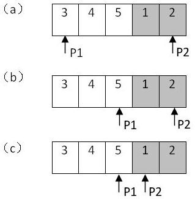

## [原文](https://www.cnblogs.com/edisonchou/p/4746561.html)

## [原文2](https://www.jianshu.com/p/c8f43b33779a)

# 剑指Offer面试题：7.旋转数组的最小数字

## 一、题目：旋转数组的最小数字
题目：把一个数组最开始的若干个元素搬到数组的末尾，我们称之为数组的旋转。
输入一个递增排序的数组的一个旋转，输出旋转数组的最小元素。
例如数组{3,4,5,1,2}为{1,2,3,4,5}的一个旋转，该数组的最小值为1。

　　这道题最直观的解法并不难，从头到尾遍历数组一次，我们就能找出最小的元素。
这种思路的时间复杂度显然是O(n)。但是这个思路没有利用输入的旋转数组的特性，肯定达不到面试官的要求。

　　我们注意到旋转之后的数组实际上可以划分为两个排序的子数组，
而且前面的子数组的元素都大于或者等于后面子数组的元素。我们还注意到最小的元素刚好是这两个子数组的分界线。
在排序的数组中我们可以用二分查找法实现O(logn)的查找。

## 二、解题思路
　　Step1.和二分查找法一样，我们用两个指针分别指向数组的第一个元素和最后一个元素。

　　Step2.接着我们可以找到数组中间的元素：

　　如果该中间元素位于前面的递增子数组，那么它应该大于或者等于第一个指针指向的元素。
此时数组中最小的元素应该位于该中间元素的后面。我们可以把第一个指针指向该中间元素，这样可以缩小寻找的范围。
移动之后的第一个指针仍然位于前面的递增子数组之中。
如果中间元素位于后面的递增子数组，那么它应该小于或者等于第二个指针指向的元素。此时该数组中最小的元素应该位于该中间元素的前面。

　　Step3.接下来我们再用更新之后的两个指针，重复做新一轮的查找。

按照上述的思路，第一个指针总是指向前面递增数组的元素，而第二个指针总是指向后面递增数组的元素。
最终第一个指针将指向前面子数组的最后一个元素，而第二个指针会指向后面子数组的第一个元素。
也就是它们最终会指向两个相邻的元素，而第二个指针指向的刚好是最小的元素。这就是循环结束的条件。

　　以前面的数组{3,4,5,1,2}为例，下图展示了在该数组中查找最小值的过程：




以上图为例首先用两个指针p1,p2分别指向数组的首尾端，首先找到中间元素5，因为5大于p1指向的元素，
所以中间元素5肯定位于第一个递增子数组中，并且最小的元素一定在它后面，所以把指针p1指向中间元素，
在此找到中间元素(1),因为1小于5，而且也小于p2指向的元素，所以1一定位于第二个递增子数组中，
并且最小元素一定在它前面或者就是它本身

 
- 需要考虑的问题：(1)起始元素=尾部元素=中间元素的(2)元素有序。

## 三、解决问题
3.1 代码实现
```java

    public static int GetMin(int[] numbers)
    {
        if (numbers == null || numbers.Length <= 0)
        {
            return int.MinValue;
        }

        int index1 = 0;
        int index2 = numbers.Length - 1;
        // 把indexMid初始化为index1的原因：
        // 一旦发现数组中第一个数字小于最后一个数字，表明该数组是排序的
        // 就可以直接返回第一个数字了
        int indexMid = index1;

        while (numbers[index1] >= numbers[index2])
        {
            // 如果index1和index2指向相邻的两个数，
            // 则index1指向第一个递增子数组的最后一个数字，
            // index2指向第二个子数组的第一个数字，也就是数组中的最小数字
            if (index2 - index1 == 1)
            {
                indexMid = index2;
                break;
            }
            indexMid = (index1 + index2) / 2;
            // 特殊情况：如果下标为index1、index2和indexMid指向的三个数字相等，则只能顺序查找
            if (numbers[index1] == numbers[indexMid] && numbers[indexMid] == numbers[index2])
            {
                return GetMinInOrder(numbers, index1, index2);
            }
            // 缩小查找范围
            if (numbers[indexMid] >= numbers[index1])
            {
                index1 = indexMid;
            }
            else if (numbers[indexMid] <= numbers[index2])
            {
                index2 = indexMid;
            }
        }

        return numbers[indexMid];
    }

    public static int GetMinInOrder(int[] numbers, int index1, int index2)
    {
        int result = numbers[index1];
        for (int i = index1 + 1; i <= index2; ++i)
        {
            if (result > numbers[i])
            {
                result = numbers[i];
            }
        }

        return result;
    }

```

　　这里需要注意的是：

　　（1）把indexMid初始化为index1的原因：一旦发现数组中第一个数字小于最后一个数字，表明该数组是排序的，就可以直接返回第一个数字了。

　　（2）特殊情况的分析：如果下标为index1、index2和indexMid指向的三个数字相等，
则只能顺序查找，因此这里定义了一个GetMinInOrder()方法。

### 3.2 单元测试

　　（1）典型输入，单调升序的数组的一个旋转

 
    // 典型输入，单调升序的数组的一个旋转
```java

    public void GetMinNumTest1()
    {
        int[] array = {3, 4, 5, 1, 2};
        Assert.AreEqual(Program.GetMin(array),1);
    }

```
　　（2）有重复数字，并且重复的数字刚好的最小的数字


```java
    // 有重复数字，并且重复的数字刚好的最小的数字
    [TestMethod]
    public void GetMinNumTest2()
    {
        int[] array = { 3, 4, 5, 1, 1, 2 };
        Assert.AreEqual(Program.GetMin(array), 1);
    }

```
　　（3）有重复数字，但重复的数字不是第一个数字和最后一个数字


```java
    // 有重复数字，但重复的数字不是第一个数字和最后一个数字
    [TestMethod]
    public void GetMinNumTest3()
    {
        int[] array = { 3, 4, 5, 1, 2, 2 };
        Assert.AreEqual(Program.GetMin(array), 1);
    }

```
　　（4）有重复的数字，并且重复的数字刚好是第一个数字和最后一个数字

```java
    // 有重复的数字，并且重复的数字刚好是第一个数字和最后一个数字
    [TestMethod]
    public void GetMinNumTest4()
    {
        int[] array = { 1, 0, 1, 1, 1 };
        Assert.AreEqual(Program.GetMin(array), 0);
    }
```
　　（5）单调升序数组，旋转0个元素，也就是单调升序数组本身


```java
    // 单调升序数组，旋转0个元素，也就是单调升序数组本身
    [TestMethod]
    public void GetMinNumTest5()
    {
        int[] array = { 1, 2, 3, 4, 5 };
        Assert.AreEqual(Program.GetMin(array), 1);
    }
复制代码
　　（6）数组中只有一个数字

复制代码
    // 数组中只有一个数字
    [TestMethod]
    public void GetMinNumTest6()
    {
        int[] array = { 2 };
        Assert.AreEqual(Program.GetMin(array), 2);
    }

```
　　（7）鲁棒性测试：输入NULL


```java
    // 鲁棒性测试：输入NULL
    [TestMethod]
    public void GetMinNumTest7()
    {
        Assert.AreEqual(Program.GetMin(null), int.MinValue);
    }
```