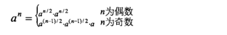

# 数值的整数次方

> 实现函数double Power(double base,int exponent)，求base的exponent次方。
不得使用库函数，同时不需要考虑大数问题。


## 方法一：

指数exponent为负，需要把exponent变为正数，然后再对base^(-exponent)取倒数；
当exponent为负数时，还需考虑base为0的情况;double和0相等的判断。


## 方法二：递归

如果我们的目标是求出一个数字的32次方，如果我们已经知道了它的16次方，那么只要在16次方的基础上再平方一次就好了，
依此类推，我们求32次方只需要做5次乘法。

我们可以利用如下公式：



```java

private double powerWithExponent2(double base,int exponent){
		if(exponent == 0){
			return 1;
		}
		if(exponent == 1){
			return base;
		}
		double result = powerWithExponent2(base, exponent >> 1);
		result *= result;
		//等于奇数的话需要再乘一次
		if((exponent&0x1) == 1){
			result *= base;
		}
		return result;
	}
```

我们用右移运算代替除2，用位与运算符代替了求余运算符（%)来判断一个数是奇数还是偶数。
位运算的效率比乘除法及求余运算的效率要高很多。


## [数值的整数次方 例子](/algorithms-java-example/src/main/java/space.mamba/coding/interviews/No11_DoublePower.java)


### [递归执行过程详解](../../020、递归执行过程详解.md)
