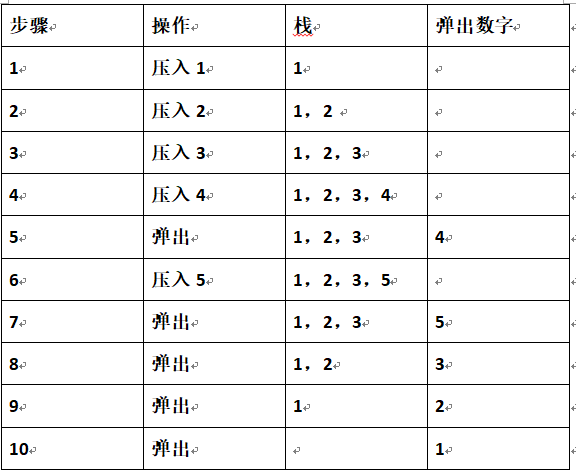
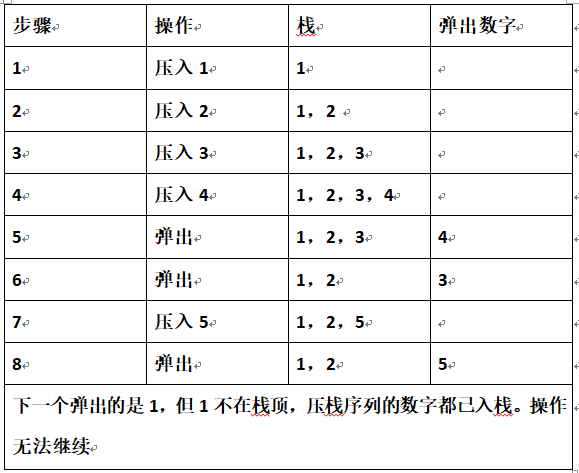

## [原文](https://www.jianshu.com/p/e39ff6a1b3ee)

# 判断一个栈是否是另一个栈的弹出序列

## 题目：
输入两个整数序列，第一个序列表示栈的压入顺序，请判断第二个序列是否为该栈的弹出顺序。
假设压入栈的所有数字均不相等。例如序列1、2、3、4、5是某栈的压栈序列，
序列4、5、3、2、1是该压栈序列对应的一个弹出序列，但4、3、5、1、2就不可能是该压栈序列的弹出序列。

## 思路：

首先借助一个辅助栈，把输入的第一个序列中的数字依次压入该辅助栈，并按照第二个序列的顺序依次从该栈中弹出数字。

以4、 5、 3、 2 、1为例分析：

再以4、3、5、1、2为例分析：

从上面的两个例子可以找到判断一个序列是不是栈的弹出序列的规律：

- 如果下一个弹出的数字刚好是栈顶数字，那么直接弹出。

- 如果下一个弹出的数字不在栈顶，我们把压栈序列中还没有入栈的数字压入辅助栈，直到把下一个需要弹出的数字压入栈顶为止。

- 如果所有的数字都压入栈了仍然没有找到下一个弹出的数字，那么该序列就不可能是一个弹出序列。
 
## 思路二

- 步骤1：栈压入序列第一个元素，弹出序列指针指弹出序列的第一个；

- 步骤2：判断栈顶元素是否等于弹出序列的第一个元素：     
  
  - 步骤2.1：如果不是，压入另一个元素，进行结束判断，未结束则继续执行步骤2；
  
  - 步骤2.2：如果是，栈弹出一个元素，弹出序列指针向后移动一位，进行结束判断，未结束则继续执行步骤2；

结束条件：如果弹出序列指针还没到结尾但已经无元素可压入，则被测序列不是弹出序列。
         如果弹出序列指针以判断完最后一个元素，则被测序列是弹出序列。
         

- [代码实现](/algorithms-demo/src/main/java/space/pankui/coding/interviews/No22_IsPopOrder.java)