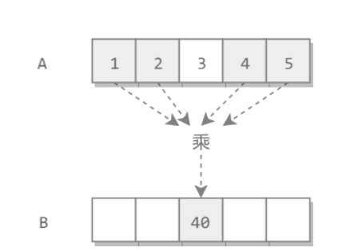

##### [原文](https://blog.nowcoder.net/n/86b0194acf644f209e74093f892f42c6)

<https://blog.nowcoder.net/n/86b0194acf644f209e74093f892f42c6>

<https://my.oschina.net/u/3973793/blog/3106112>

# 构建乘积数组

## 题目：
给定一个数组A[0,1,...,n-1],请构建一个数组B[0,1,...,n-1],其中B中的元素B[i]=A[0]*A[1]*...*A[i-1]*A[i+1]*...*A[n-1]。
不能使用除法。

## 思路：

我们发现，这题如果不让用除法，那就不能用最简单的O(n)来做。但是能否换种思路呢？
我们发现规律，连乘积是从中间某个位置断开的，如果我们从断开位置可以保存左右的状态，那么就没问题了。
怎么保持状态呢？在这个题目中只能用乘法。乘法要求公因子越来越多才有机会保存状态。

### 方法1：

两重循环，在遍历数组A的时候，A[i]赋值为1，计算B[i]，时间复杂度：O(n^2)

### 方法2：

 构建前向乘积数组C[i]=A[0]*A[1]*...*A[i-1]，即C[i]=C[i-1]*A[i-1]；

 构建后向乘积数组D[i]=A[n-1]*A[n-2]*...A[n-i+1]，即D[i]=D[i+1]*A[i+1]；

 通过C[i],D[i]来求B[i]：B[i]=C[i]*D[i]

 时间复杂度：O(n)

## 实践例子

[No52_Multiply](/algorithms-demo/src/main/java/space/pankui/coding/interviews/No52_Multiply.java)

