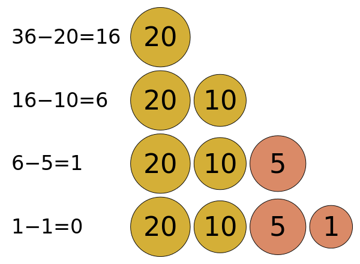
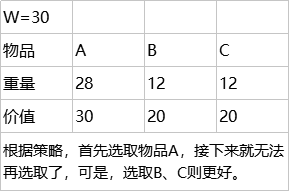
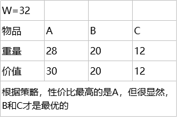

## [原文](https://zh.wikipedia.org/wiki/%E8%B4%AA%E5%BF%83%E7%AE%97%E6%B3%95)

## [原文](https://www.cnblogs.com/xiaozhang2014/p/7783795.html)

# 贪心算法

贪心算法（英语：greedy algorithm），又称贪婪算法，是一种在每一步选择中都采取在当前状态下最好或最优（即最有利）的选择，
从而希望导致结果是最好或最优的算法。
比如在旅行推销员问题中，如果旅行员每次都选择最近的城市，那这就是一种贪心算法。
> 一般人换零钱的时候也会应用到贪心算法。把$36换散︰$20 > $10 > $5 > $1



贪心算法在有最优子结构的问题中尤为有效。最优子结构的意思是局部最优解能决定全局最优解。
简单地说，问题能够分解成子问题来解决，子问题的最优解能递推到最终问题的最优解。

贪心算法与动态规划的不同在于它对每个子问题的解决方案都做出选择，不能回退。
动态规划则会保存以前的运算结果，并根据以前的结果对当前进行选择，有回退功能。

贪心法可以解决一些最优化问题，如：求图中的最小生成树、求哈夫曼编码……对于其他问题，
贪心法一般不能得到我们所要求的答案。
一旦一个问题可以通过贪心法来解决，那么贪心法一般是解决这个问题的最好办法。
由于贪心法的高效性以及其所求得的答案比较接近最优结果，
贪心法也可以用作辅助算法或者直接解决一些要求结果不特别精确的问题。


## 应用

- 对于大部分的问题，贪心法通常都不能找出最佳解（不过也有例外），
因为他们一般没有测试所有可能的解。
贪心法容易过早做决定，因而没法达到最佳解。例如，所有对图着色问题。

- 贪心法在系统故障诊断策略生成乃至高校的排课系统中都可使用。 

## 举例

最小生成树的算法 (Prim MST、Kruskal MST、Djikstra's algorithm)


## 贪心算法的几个例子

### 1. 纸币找零问题

假设1元、2元、5元、10元、20元、50元、100元的纸币，张数不限制，现在要用来支付K元，至少要多少张纸币？

很显然，我们很容易就想到使用贪心算法来解决，并且我们所根据的贪心策略是，
每一步尽可能用面值大的纸币即可。当然这是正确的，代码如下：

```java

/**
     * 钱币找零问题
     *
     * @param money the money
     */
    public static void greedyGiveMoney(int money) {
        System.out.println("需要找零: " + money);
        int[] moneyLevel = {1, 5, 10, 20, 50, 100};
        for (int i = moneyLevel.length - 1; i >= 0; i--) {
            int num = money/ moneyLevel[i];
            int mod = money % moneyLevel[i];
            money = mod;
            if (num > 0) {
                System.out.println("需要" + num + "张" + moneyLevel[i] + "块的");
            }
        }
    }

```

（1）如果不限制纸币的金额，那这种情况还适合用贪心算法么。
比如1元，2元，3元，4元，8元，15元的纸币，用来支付K元，至少多少张纸币？

经我们分析，这种情况是不适合用贪心算法的，因为我们上面提供的贪心策略不是最优解。
比如，纸币1元，5元，6元，要支付10元的话，按照上面的算法，至少需要1张6元的，4张1元的，
而实际上最优的应该是2张5元的。

（2）如果限制纸币的张数，那这种情况还适合用贪心算法么。
比如1元10张，2元20张，5元1张，用来支付K元，至少多少张纸币？

同样，仔细想一下，就知道这种情况也是不适合用贪心算法的。
比如1元10张，20元5张，50元1张，那用来支付60元，按照上面的算法，
至少需要1张50元，10张1元，而实际上使用3张20元的即可；

（3）所以贪心算法是一种在某种范围内，局部最优的算法。


### 2. 背包问题： 
有一个背包，背包容量是W=150。有7个物品，每个物品有各自的重量和价值，每个物品有一件。
要求尽可能让装入背包中的物品总价值最大，但不能超过总容量。
```
物品 A B C D E F G 
重量 35 30 60 50 40 10 25 
价值 10 40 30 50 35 40 30
```
我们很容易想到使用贪心算法来解决这个问题，那我们考虑一下贪心策略：

（1）每次挑选价值最大的物品放入背包，得到的结果是否最优？

（2）每次挑选所占重量最小的物品放入背包，得到的结果是否最优？

（3）每次选取单位重量价值最大的物品，得到的结果是否最优？

值得注意的是，贪心算法并不是完全不可以使用，贪心策略一旦经过证明成立后，它就是一种高效的算法。
但可惜的是，它需要证明后才能真正运用到题目的算法中。

而上面的3中贪心策略，都是无法成立的，即无法被证明的：


 	 
 第一条和第二条类似，第三条，选取单位重量价值最大的物品：



以上问题使用贪心算法是解决不了的，而普通背包问题可以使用贪心算法来解决。
这个问题是属于0-1背包问题，不过我们可以考虑使用动态规划来解决，那就是另一个问题了。

普通背包问题和0-1背包问题差不多，0-1背包的每件物品只有一件，而普通背包的每件物品数量是不止一件的，
如果每件物品的数量是无限的，那这种称为完全背包问题；

 